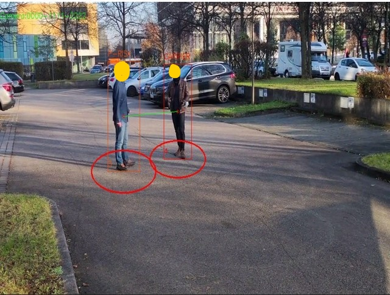
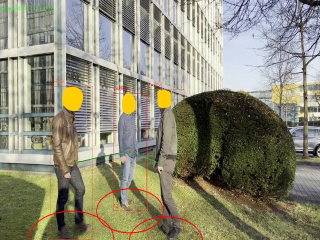

# Using ReID to Track an Infected COVID-19 Carrier in Pandemic Scenarios

Estimated completion time: ~60-100 mins.

Requirements:
- K8s cluster
- Sedna
- KubeEdge
- Internet connection to download the containers images
- Optional: multi-node cluster

# Introduction

This proposal introduces an edge-cloud distributed system to help identify and track potential carriers of the COVID-19 virus. By detecting proximity or contact risks, we have the ability to monitor the possible contamination of bystanders. The goal is to counter the spread of the virus and help against the global pandemic crisis. The key AI component in our proposal is the ReID: Re-Identification (ReID) solves the problem of, given a set of images of an object, finding all occurrences of the same subject in a database. The database contains images collected from cameras at different points in time. One of the problems of this approach is the need to create a domain-specific gallery before it is possible to find the target.

However, our ReID solution is much more advanced as it does not require a gallery, instead, it uses an on-the-fly search mechanism which greatly simplifies the deployment of the application as the gallery creation phase is completely skipped.

The example images below show the ability of our system to re-identify a potential carrier of the virus and detect close contact proximity risk.

 

# System Architecture and Components

The image below shows the system architecture and its simplified workflow:


## Components

**ReID Job**: it performs the ReID.

- Available for CPU only.
- Folder with specific implementation `examples/multiedgeinference/pedestrian_tracking/reid`.
- Component specs in `lib/sedna/core/multi_edge_inference/components/reid.py`.
- Defined by the Dockerfile `multi-edge-inference-reid.Dockerfile`.

**Feature Extraction Service**: it performs the extraction of the features necessary for the ReID step.

- Available for CPU and GPU.
- Folder with specific implementation details `examples/multiedgeinference/pedestrian_tracking/feature_extraction`.
- Component specs in `lib/sedna/core/multi_edge_inference/components/feature_extraction.py`.
- Defined by the Dockerfile `multi-edge-inference-feature-extraction.Dockerfile` or `multi-edge-inference-gpu-feature-extraction.Dockerfile`.
- It loads the model defined by the CRD in the YAML file `yaml/models/model_m3l.yaml`.

**VideoAnalytics Job**: it performs tracking of objects (pedestrians) in a video.

- Available for CPU and GPU.
- Folder with specific implementation details `examples/multiedgeinference/pedestrian_tracking/detection`.
- AI model code in `examples/multiedgeinference/detection/estimator/bytetracker.py`.
- Component specs in `lib/sedna/core/multi_edge_inference/components/detection.py`.
- Defined by the Dockerfile `multi-edge-inference-videoanalytics.Dockerfile` or `multi-edge-inference-gpu-videoanalytics.Dockerfile`.
- It loads the model defined by the CRD in the YAML file `yaml/models/model_detection.yaml`.

# Build Phase

Go to the `sedna/examples` directory and run: `./build_image.sh -r <your-docker-private-repo> multiedgeinference` to build the Docker images. Remember to **push** the images to your own Docker repository!

Run `make crds` in the `SEDNA_HOME` and then register the new CRD in the K8S cluster with `make install crds` or:
- `kubectl create -f sedna/build/crd/sedna.io_featureextractionservices.yaml`
- `kubectl create -f sedna/build/crd/sedna.io_videoanalyticsjobs.yaml`
- `kubectl create -f sedna/build/crd/sedna.io_reidjobs.yaml`

Build the GM `make gmimage` and restart the Sedna GM pod.

Additionally, this application requires to:

1. Create a NFS on the master node and network shared folder accessible by the pods through a PVC.
2. Create a PV and PVC on the K8s cluster.
3. Have a basic Kafka deployment running.
4. Have a streaming server running. 

We offer two installation methods:
- [Manual Installation](#manual-installation): slow, highly recommended to understand how the application works.
- [Automated Installation](#automated-installation): quick, but harder to debug in case of misconfigurations. 

# **Manual Installation**

This procedure will guide you step-by-step in the process of setting up your cluster and then run the example application for pedestrian ReID in pandemic scenario. We recommend following the manual installation if your cluster setup is somewhat different from the usual configuration or customized.

We also recommend following the manual setup if you are familiar with K8s concepts to fully understand which components are deployed.

## 1. NFS Server

Using a local NFS allows to easily share folders between pods and the host. Also, it makes straightforward the use of PVs and PVCs which are used in this example to load volumes into the pods. However, there are other options to achieve the same result which you are free to explore.

1. To setup the NFS, run the following commands on a node of your cluster (for simplicity, we will assume that we selected the **master** node):

    ```
    sudo apt-get update && sudo apt-get install -y nfs-kernel-server
    sudo mkdir -p /data/network_shared/reid
    sudo mkdir /data/network_shared/reid/processed
    sudo mkdir /data/network_shared/reid/query
    sudo mkdir /data/network_shared/reid/images
    sudo chmod 1777 /data/network_shared/reid
    sudo bash -c "echo '/data/network_shared/reid *(rw,sync,no_root_squash,subtree_check)' >> /etc/exports"
    sudo exportfs -ra
    sudo showmount -e localhost # the output of this command should be the folders exposed by the NFS
    ```

2. If you have other nodes in your cluster, run the following commands on them:

    ```
    sudo apt-get -y install nfs-common nfs-kernel-server
    showmount -e nfs_server_node_ip #nfs_server_node_ip is the IP of the node where you ran the commands in step (1.)
    sudo mount nfs_server_node_ip:/data/network_shared/reid /data/network_shared/reid
    ```

## 2. PV and PVC

1. Change the server and storage capacity field in the `yaml/pv/reid_volume.yaml` as needed.
2. Run `kubectl create -f yaml/pv/reid_volume.yaml`.
3. Change the storage request field in the `yaml/pvc/reid-volume-claim.yaml` as needed.
4. Run `kubectl create -f yaml/pvc/reid-volume-claim.yaml`.

The VideoAnalytics and ReID jobs will make use of this PVC. The mounting is made so that the directory structure on the host is mirrored in the pods (the path is the same).

## 3. Apache Kafka

1. Edit the YAML files under `yaml/kafka` so that the IP/hostname address match the one of your master node. For a basic deployment, it's enough to have a single replica of Zookeeper and Kafka both running on the same node.
2. Run these commands:
    ```
    kubectl create -f yaml/kafka/kafkabrk.yaml
    kubectl create -f yaml/kafka/kafkasvc.yaml
    kubectl create -f yaml/kafka/zoodeploy.yaml
    kubectl create -f yaml/kafka/zooservice.yaml
    ```
3. Check that Zookeeper and the Kafka broker is healty (check the logs, it should print that the creation of the admin topic is successful).
4. Note down your master node external IP, you will need it later to update a field in two YAML files.
    - If you are running on a single node deployment, the above step is not required as the default service name should be automatically resolvable by all pods using the cluster DNS (*kafka-service*).
    - This step is also not necessary if you are not running kubeedge.

### REST APIs

This application also supports direct binding using REST APIs and edgemesh/K8s services. In case you don't want to use Kafka, you can disable it by setting `kafkaSupport: false` in the `feature-extraction.yaml` and `video-analytics-job.yaml` YAML files and just let the different components communicate using REST API. However, we recommend using Kafka at first as the rest of the tutorial assumes that it's running.

## 4. Streaming Server

We use the [EasyDarwin](https://github.com/EasyDarwin/EasyDarwin) streaming server, you can have it running either on the master or edge node. Just remember to take note of the IP of the node where it's running, you will need it later.

```
wget https://github.com/EasyDarwin/EasyDarwin/releases/download/v8.1.0/EasyDarwin-linux-8.1.0-1901141151.tar.gz -o ss.tar.gz
tar -xzvf ss.tar.gz
cd EasyDarwin-linux-8.1.0-1901141151
sudo ./easydarwin
```
# Application Deployment

First, make sure to copy the AI models to the correct path on the nodes **BEFORE** starting the pods. If you use the YAML files provided with this example:

- The node running the VideoAnalytics job should have the YoloX model in `"/data/ai_models/object_detection/pedestrians/yolox.pth"`.
- The node running the feature extraction service should have the required model:`"/data/ai_models/m3l/m3l.pth"`.

Do the following:
- Run `kubectl create -f yaml/models/model_m3l.yaml`
- Run `kubectl create -f yaml/models/model_detection.yaml`
- Start the streaming server (if you didn't do it yet AND are planning to process a RTSP stream).

# Running the application

The provided YAML files are configured to run the feature extraction and ReID pods on the **master** node, while the VideoAnalytics runs on an **agent** node. This is configured using the *nodeSelector* option which you can edit in case you want to deploy the pods differently. For example, you can also simply **run everything on the master node**.

Download the sample video and query images which will be placed in the NFS folder:
```
wget https://drive.google.com/file/d/1HTpzY09bQJe-68d09We3fUrd7REXK5j5/view?usp=sharing -o test_video.zip
unzip test_video.zip
sudo cp -r test_video/query /data/network_shared/reid/query #copy sample images to query folder
sudo cp test_video/test_video.mp4 /data/network_shared/reid/video/test_video.mp4 #copy sample video to video folder
```

Now, let's create the feature extraction service: `kubectl create -f yaml/feature-extraction-service.yaml` and check that it's healhty.

Following, the application workflow is divided in 2 parts: analysis of the video and ReID.

## Workflow: Part 1

1. Modify the env variables in `yaml/video-analytics-job.yaml`:
    - Make sure that the IP in `video_address` is the same as the streaming server address (if you are using RTSP).
    - We recommend setting the FPS parameter to a small value in the range [1,5] when running on CPU.
2. Create the VideoAnalytics job: `kubectl create -f yaml/video-analytics-job.yaml`
3. Send a video to the streaming server using FFMPEG, for example: `ffmpeg -re -i /data/network_shared/reid/video/test_video.mp4 -vcodec libx264 -f rtsp rtsp://<RTSP_SERVER_IP>/video/0`
4. If everything was setup correctly, the pod will start the processing of the video and move to the `Succeeded` phase when done.
5. **NOTE**: Keep in mind that, depending on the characteristics of the input video, this steps can take a considerable amount of time to complete especially if you are running on CPU. Moreover, this job will not exit until it receives all the results generated from the feature extraction service. Check the VideoAnalytics job and its logs to check the progress status.

## Workflow: Part 2
1. Modify the env variables in `yaml/reid-job.yaml`:
    - Make sure that `query_image` is a **pipe-separated** list of images matching the content of the `/data/query` folder.
2. Create the ReID job: `kubectl create -f yaml/reid-job.yaml`
3. If everything was setup correctly, the pod will start the target search in the frames extracted from the video and move to the `Succeeded` phase when done.
4. Finally, in the folder `/data/network_shared/reid/images` you will find the final results.


# Cleanup

Don't forget to delete the jobs once they are completed:
- `k delete -f multiedgeinference/pedestrian_tracking/yaml/video-analytics-job.yaml`
- `k delete -f multiedgeinference/pedestrian_tracking/yaml/reid-job.yaml`

To also delete the feature extraction service:
- `k delete -f multiedgeinference/pedestrian_tracking/yaml/feature-extraction.yaml`

# **Automated Installation**

The automated installation procedure will run for you the majority of the configuration steps and prepare the cluster to run the application. If something goes wrong, it will prompt the user with an error message. There are three scripts available in the `tutorial` folder:

1. The `deploy.sh` script setups the cluster and bootstraps the required components, it has to be **run at least once** before running `run.sh`. It assumes that:
    - You didn't change anything manually in the provided YAML files except for the ENV variables injected in the application pods (feature extraction, video analytics and reid).
    - You input the **correct** values to the `deploy.sh` script before launching it:
        - External IP of the master node.
        - Path to the NFS (depending on your configuration, this can also be the default value).
    - Example: `./deploy.sh -a 10.1.1.1 -p /data/network_shared/reid`

2. The `run.sh` script will run the application on your cluster. It assumes that:
    - The environment variables for the VideoAnalytics and ReID job are configured correctly as explained in the [Running the application](#running-the-application) section above.
    - If you are processing a video stream, launch the script as follows:
        - `run.sh -s <RTSP_SERVER_IP> -f VIDEO_PATH`
        - For example: `./run.sh -s 7.182.8.79 -f /data/network_shared/reid/video/test_video.mp4`

3. The `cleanup.sh` script can be used to perform a complete cleanup of the resources created on the cluster except for the NFS directory, that you have to delete manually.

All the scripts must be launched from the tutorial folder and require `sudo`. Also, the `deploy.sh` will create a `backup` folder where it stores the original version of the YAML files in case you want to revert the changes performed by the scripts.

## What the automated installation won't do for you

1. Put the AI model in the correct directory.
2. Add the query images used by ReID to find a target.
3. Configure parameters such as ReID threshold or RTSP streaming server.
